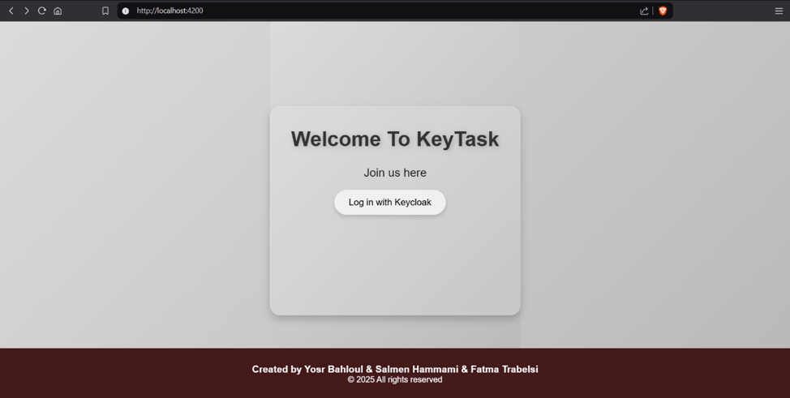
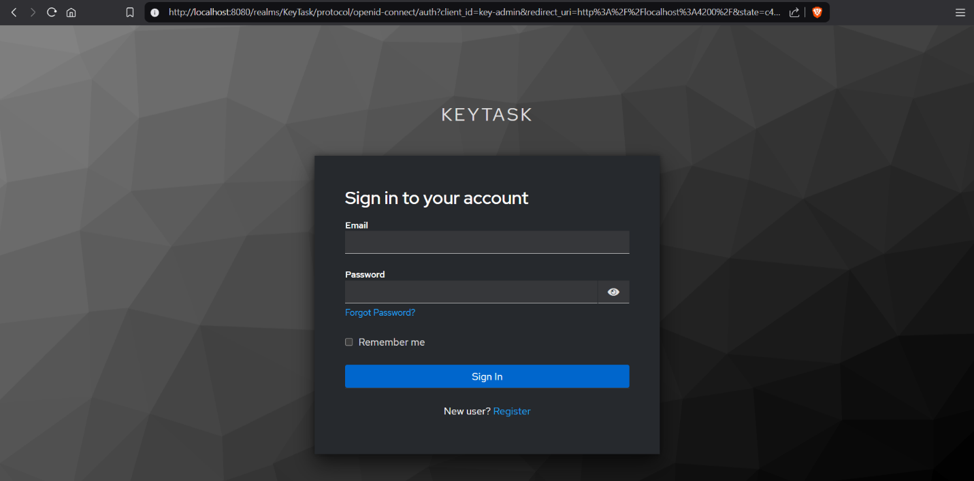

<p align="center">
  
</p>

# KeyTask

A secure, full-stack task management application featuring centralized identity management and role-based access control. 

## Overview

**KeyTask** simplifies task organization and team collaboration without compromising security. Built around modern identity protocols, it manages user workflows, group administration, and task assignments backed by enterprise-grade OAuth2/OIDC authentication.

## Preview

| Landing Page | Keycloak SSO Authentication |
| :---: | :---: |
|  |  |

## Key Features

* **Workspace & Task Tracking:** Create, assign, and manage daily tasks across customizable team groups.
* **Centralized Authentication:** Integrated with Keycloak for Single Sign-On (SSO) using OAuth2 and OpenID Connect (OIDC).
* **Role-Based Access Control (RBAC):** Fine-grained permission rules governing administrative and user actions across endpoints.
* **Interactive UI:** Clean, responsive interface for tracking task progress and user assignments.

## Tech Stack

* **Backend:** Java Spring Boot (REST APIs)
* **Frontend:** Angular
* **Security & Identity:** Keycloak (OAuth2 / OIDC)
* **Database:** MongoDB
* **Build & Version Control:** Maven, Git

## Getting Started

### Prerequisites
* JDK 17+ and Maven
* Node.js & Angular CLI

### Quick Setup

```bash
# Clone the repository
git clone https://github.com/HammamiSalmen/KeyTask.git
cd KeyTask

# Launch the backend service
cd backend
./mvn spring-boot:run

# Launch the Angular frontend
cd ../frontend
npm install
ng serve
